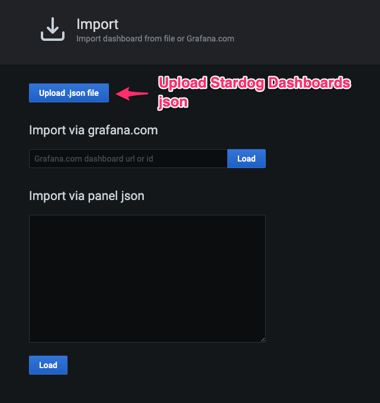

Stardog Grafana Dashboard
=========================

Stardog provides a preconfigured Stardog dashboard for Grafana in the form of a json files which can
be imported into Grafana. In order to be able to use the dashboard you must have Prometheus
configured to scrape Stardog kubenetes pods for metrics data.

*screen shots go here*

Step 1: Configuring Prometheus to scrape Stardog
------------------------------------------------

We recommend that you create a Stardog user specifically for monitoring. This user will not be
able to read data but will be able to access the Prometheus monitoring endpoint:

    stardog-admin user add monitor

If you don't have Prometheus deployed already on your K8S cluster we recommend deploying using
[Prometheus Helm Hub](https://hub.helm.sh/charts/stable/prometheus) templates. To scape Stardog pods
with Prometheus you must create addition scrape jobs. When using Prometheus deployed with Helm the
simplest way is to pass in additional scaraping configs using a helm values file
[prometheus-stardog-values.yaml](./prometheus-stardog-values.yaml) provided in this repository. However,
a similar scrape job configuration can be passed to Prometheus without Helm if desired. Be sure to replace
the password for the `monitor` user with the one created above.

Step 2: Creating a Prometheus Data Source for Grafana
--------------------------------------------

Once you have successfully configured Prometheus to scrape stardog metrics you should create a
Grafana Prometheus data source if you don't have already configured. Grafana provides [detailed
instructions](https://grafana.com/docs/grafana/latest/features/datasources/prometheus/) for how to
do this.

Step 3: Import the Stardog Grafana Dashboard
--------------------------------------------

Download the two json for our two provided dashboard:

- [stardog-overview.json](https://raw.githubusercontent.com/stardog-union/stardog-examples/develop/examples/grafana/stardog-overview.json)
- [stardog-databases.json](https://raw.githubusercontent.com/stardog-union/stardog-examples/develop/examples/grafana/stardog-databases.json)

Download via curl:

    curl -o stardog-overview.json https://raw.githubusercontent.com/stardog-union/stardog-examples/develop/examples/grafana/stardog-overview.json
    curl -o stardog-databases.json https://raw.githubusercontent.com/stardog-union/stardog-examples/develop/examples/grafana/stardog-databases.json

The follow the [Grafana instructions](https://grafana.com/docs/grafana/latest/reference/export_import/#importing-a-dashboard)
for importing a dashbaord with a json file.

